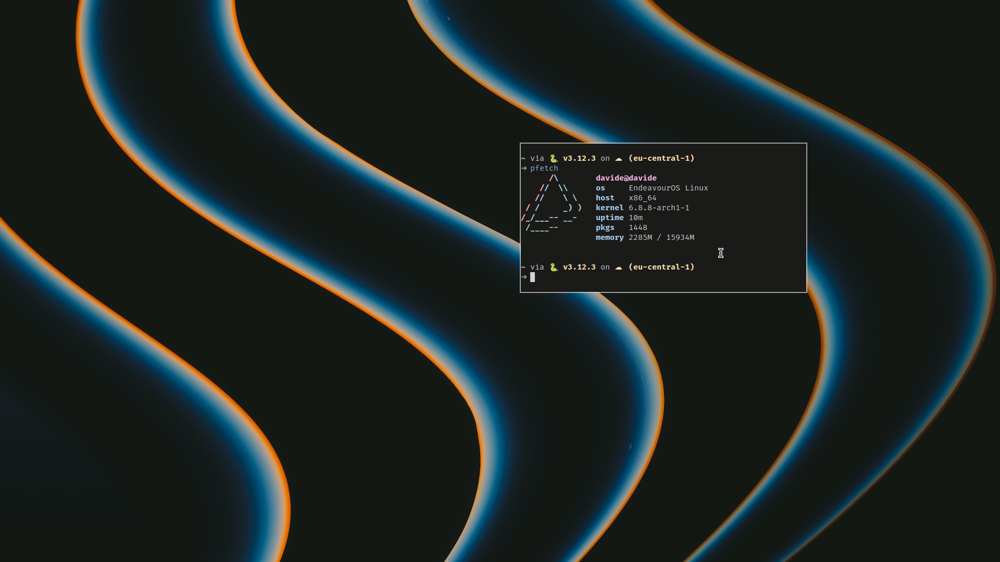
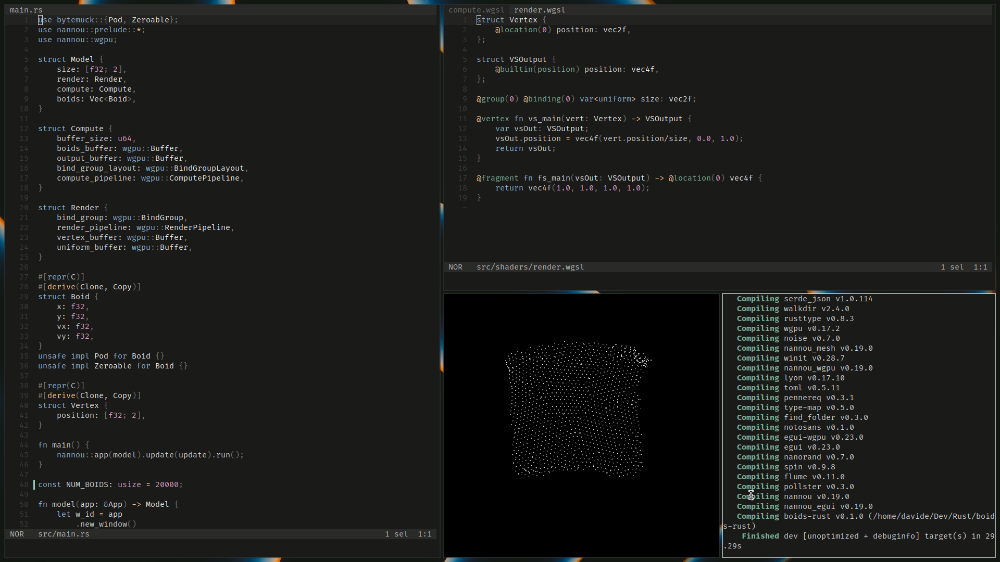

This repository contains my personal dotfiles and configuration settings for by ideal Arch linux setup.

# Overview
- WM: `hyprland`
- Terminal Emulator: `alacritty`
- Color Scheme: `rasmus`
- Editor: `helix`
- Shell: `fish`
- Shell Prompt: `starship`
- File Manager: `lf`

# Screenshots




# Usage
This repo is managed as a _bare repository_ and referenced by the `dots` alias. Its important to set `showUntrackerFiles` to false to have a cleaner `git status`.

```bash
# dotfiles alias
alias dots='git --git-dir=$HOME/.dotfiles --work-tree=$HOME'

# settings of the .dotfiles bare repo
dots config --local status.showUntrackedFiles no
```
